# Week #5: CTF

### **Objective**

The objective of this CTF is to explore buffer overflow vulnerabilities.

Each challenge gives us a vulnerable program and we have to take control of the functionalities of the program while it's runnig to read the file flag.txt in the working directory

## Challenge 1

### **Recognition**

First we checked the permissions with which the program was compiled using checksec:

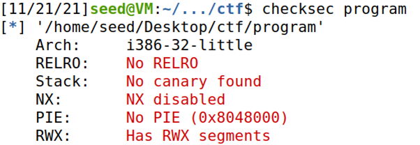

*Figure 1: Checksec results.*

**With this we can conclude that:**
- The file architecture is x86 (Arch).
- RELRO is not active.
- There is no canary protecting the return address, making it easier to inject code through the stack.
- NX is disabled which means that the program has execution permission.
- PIE is disabled which means that the binary positions are not randomized.
- RWX has some segments which means that some regions of memory have read, write and execution permission.

**Second we analyzed the source code of the challenge and we concluded that:**
- The program opens the file “mem.txt” in read mode.
- Since the name of the file is saved in a local variable, changing the name stored in that variable would lead to the program opening a different file.

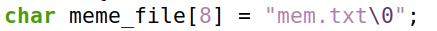

*Figure 2: Variable saved in memory.*

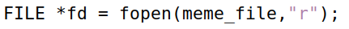

*Figure 3: Line where the file is opened.*

- The buffer has an overflow vulnerability since the function scanf tries to read 28 chars to the buffer and it only has space for 20. After 20 bytes read the meme_file array will be overwritten with the last 8 bytes scanned through the stdin, as it’s on top of the buffer in the call stack.

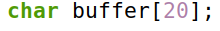

*Figure 4: Buffer.*

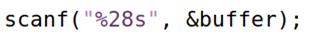

*Figure 5: Scanf which allows us to write more into the buffer then it supports.*

### **FLAG #1: flag{eec724f5061da428f98387d96301917f}**

With this information we altered the exploit-example.py script to send 20 random characters to fill the buffer plus the name of the file, “flag.txt”.

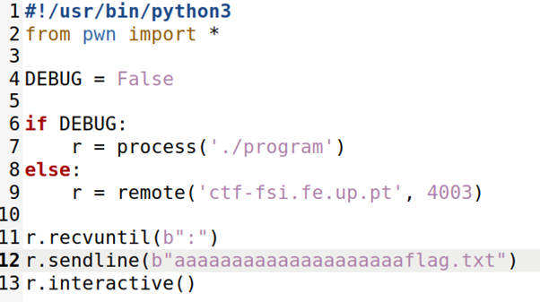
*Figure 6: exploit-example.py file.*

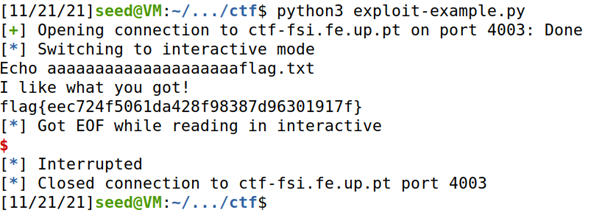
*Figure 7: Successfull attack.*

## Challenge 2

### **Recognition**

Once again we first we checked the permissions with which the program was compiled using checksec:

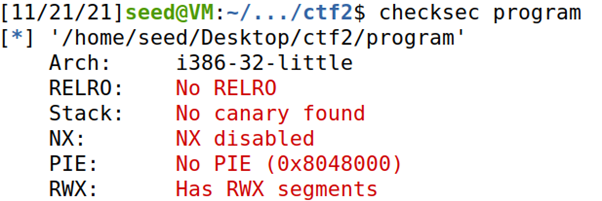

*Figure 8: Checksec results.*

As stated in the challange description, the permissions are the same as in the first challenge.

**Comparing the two files we noticed that:**
- A new array of chars called “val” was added which cancels the opening of the file if its values are different than 0xfefc2122.

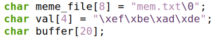

*Figure 9: Array val.*

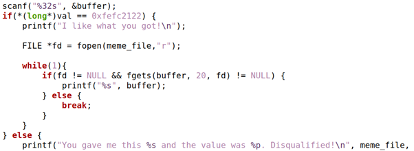
*Figure 10: Check of the contents of the array val by the progrm.*

- The scanf now reads 32 chars from the stdin instead of 28.

- This doesn’t erase the exploit all together since we can still overflow the buffer in order to change “meme_file” value, we only need to make sure that the value of “val'' equals the one in the if statement.

### **FLAG #2: flag{f290448482c1793341d2edaf70e9cf41}**

With this information we altered the exploit-example.py script to send 20 random characters to fill the buffer, the correct characters so that “val” would let us open the file and the name of the file, “flag.txt”.

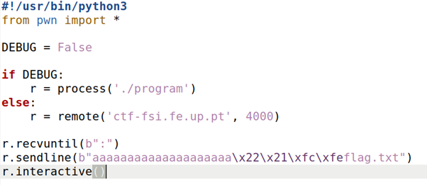
*Figure 11: exploit-example.py file.*

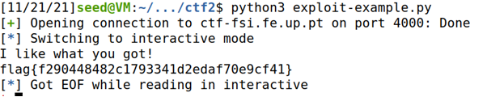
*Figure 12: Successfull attack.*
