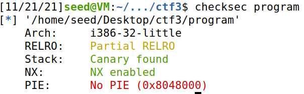
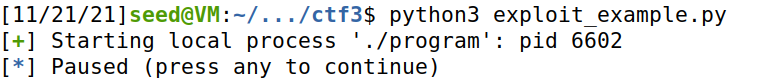
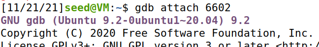
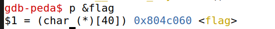
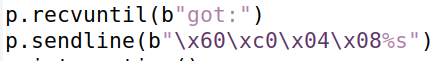
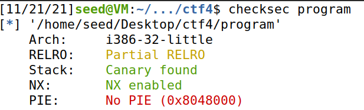
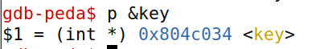
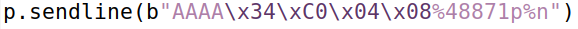

# Week #6: CTF

### **Objective**

The objective of this CTF is to explore format string vulnerabilities.

## Challenge 1

### **Recognition**

First we used checksec to check for the permissions with which the program was compiled.

*Figure 1: Checksec results.*

**With this we can conclude that:**
- The file architecture is x86 (Arch).
- RELRO is partially active.
- There is a canary protecting the return address.
- NX is enabled which means that the program has no execution permission.
- PIE is not enabled which means that the binary positions are not randomized.

**Looking at the source code we concluded that:**
- The format function printf() which is printing a buffer whose contents are taken from the standard input.
- This constitutes a format string vulnerability in which we can make the format function interpret the content on the buffer as a command, for example make it jump to an address or use “%s” to force it to read and print the stack.
- This constitutes a format string vulnerability in which we can write a stack address to a local/global variable, find out where the written address is in the stack (using %p to jump positions) and read the information stored in the given address, in this case “file”, an array of chars, as a string %s.
- Since the flag is a global variable stored in the stack and gdb can give us its address which is not randomized since PIE is not enabled we can obtain it easily.

First we ran the program locally to find out what the global variable’s address was.

*Figure 2 - paused program with pid 6602*

To do this while the program was paused we used its pid to run gdb on it and then used the command “p &flag” to get the global variable’s address.

*Figure 3 - gdb running on the process*

*Figure 4 - flag's address*

Knowing this address we changed what’s written to the program by the example-exploit.py to jump to the address and then print its contents.

*Figure 5: line sent.*

After making sure that this worked locally we change Local to false and ran it in the server obtain the following flag as a result:

**flag{278264d5cc00ee26ee075055421f2596}**

## Challenge 2

Once again we ran checksec:

*Figure 6: Checksec results.*

And concluded that it has the same permissions as the program in challenge 1.

Looking at the source code we concluded that:
- The vulnerability is in line 14 in the printf. Without the format string this function interprets strings such as “%s” and “%n” as commands rather than a string to print.
- The flag is in the file “flag.txt”  in the working directory that can be read through the bash executed if the global variable key is changed to “0xbeef”. Due to the previously described vulnerability it is possible for us to change this value.
- Write to the buffer something that let’s us jump to the global variable key’s address and change it’s value to “0xbeef”.

First we ran gdb with our process' PID to get the global variable key’s address.

*Figure 7 - flag's address*

Next we changed the string format in the exployt-example.py:

“0xbeef” represents 48879 in decimal so that’s the value that’ll have to write to our key variable. The string formatting command %n writes the number of characters before it, so, in order to overwrite the key we have to:
1. Move to the variable key’s
2. 2 place 48879 characters before %n so that it writes the correct value.
    - \x34\xc0\x04\x08 is going to send us to key’s address;
    - The four “A” characters at the beginning plus the 4 bytes occupied by the address plus the command %48871p which represents 48871 characters, we have the 48879 characters that we need to place before the %n;

After running the exploit we need to only to run cat flag.txt to see our flag: 

**flag{45e9e237f1e36f0c7718b3d17dbec6dd}**
