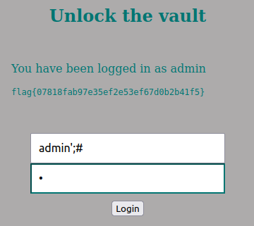
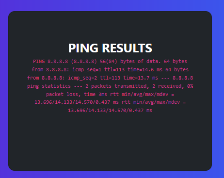
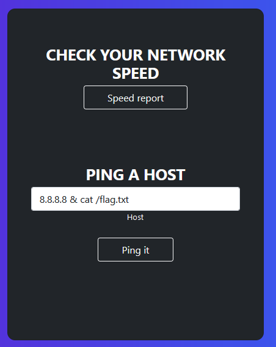
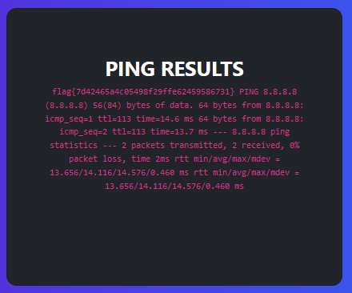

# CTF Week #8

## Challenge #1

Our objective is to login as admin, to achieve that we first analyzed the application:

- The application only asks for login credentials (username and password).
- Since login credentials are always stored in an SQL database if the php page does not verify the inputs carefully then we might be able to do an SQL injection and log in a given user without knowing the password of the account.

```php
$username = $_POST['username'];
$password = $_POST['password'];
$query = "SELECT username
FROM user
WHERE username = '".$username."' AND password = '".$password."'";
```

- From the source code we can see that there is no verification of the structure of the user input (that might be an SQL query) therefore the query statement is vulnerable.

- Knowing this we started by formulating an input that would let us bypass the password verification:

```php
$query = "SELECT username
FROM user
WHERE username = 'admin’;#' AND password = '".$password."'";
```

The `#` comments the part of the query statement that verifies the password while the `'` ends the string being concatenated. The `;` ends the php statement. With this we logged in as administrator and obtained the flag: `flag{07818fab97e35ef2e53ef67d0b2b41f5}`

|                                      |
| :----------------------------------------------------------: |
| *Figure 1: Obtaining the flag by inputing `admin'#` into the username parameter.* |

## Challenge #2

Our objective is to access a flag that's present in the file `/flag.txt`. In order to do that we must first make the following assessments:

- Without authentication we can input an `Email`, a `Password` and in the "Check out your network status!" page we can input a `Host` to ping.
- We can assume that the authentication inputs are querying the database in order to login the user. The `Host` input is using some kind of linux utility to ping the given host. Given the output delivered by the "Ping Results" page we can assume that the site is using the `ping` linux utility.

|                                      |
| :----------------------------------------------------------: |
| *Figure 2: Ouptut provided by the "Ping Results" page with Host 8.8.8.8* |

- If there's no especial treatement to the user input we can add more parameters, linux utilitaries or arguments and they'll be executed as well. Therefore, if this protection is not implemented we'll be able to run other linux utilitaries such as `cat` to print out the content in the `/flag.txt` file.

|||
|:-:|:-:|
|*Figure 3: Inputting `8.8.8.8 & cat /flag.txt` to obtain the flag*|*Figure 4: Output provided by the "Ping Results" page with the input `8.8.8.8 & cat /flag.txt`*|

As we can observe we obtained the flag `flag{7d42465a4c05498f29ffe62459586731}`.