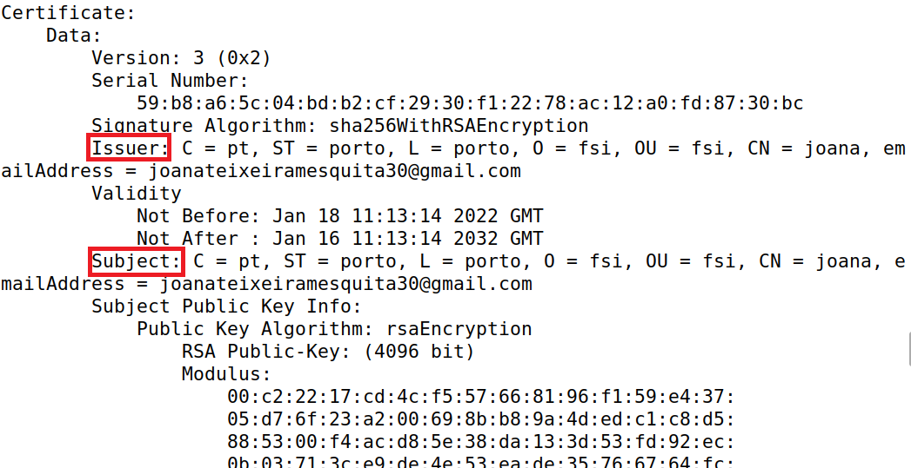
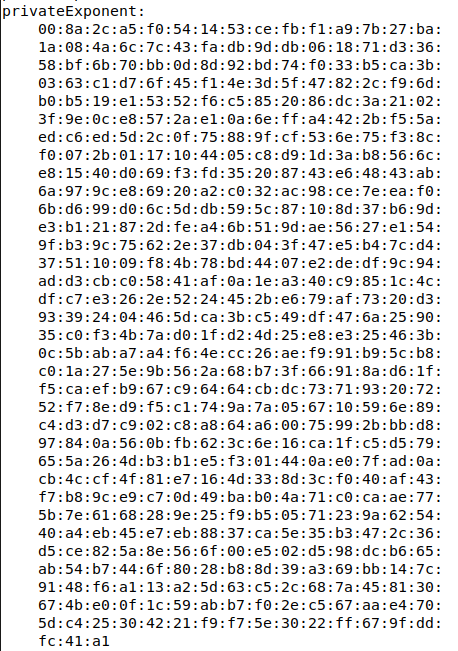

# Week #11: Public-Key Infrastructure (PKI)

## Task #1: Becoming a Certificate Authority (CA)

In this task we are going to create CA certificates by becomming a CA root ourselves. 

For that, we coppied the file openssl.cnf from */usr/lib/ssl/openssl.cnf*, created an empty file index.txt and a file with a number serial. 

After we ran the command to generate the self-signed certificate for the CA and obtained a ca.crt (CA’s private key) and a ca.key (public-key certificate) files.

To decode the content of the X509 certificate and the
RSA key we used the commands bellow.

```
openssl x509 -in ca.crt -text -noout
openssl rsa -in ca.key -text -noout
```

- What part of the certificate indicates this is a CA’s certificate?

From the running the command to obtain the decoded X509 certificate from the CA’s private key file we can find out the indication that this is indeed a CA certificate.


|                          |
| :----------------------------------------------------------: |
| *Figure 1: Section of the decoded X509 certificate wich indicates that this is a CA certificate* |

- What part of the certificate indicates this is a self-signed certificate?

From the running the command to obtain the decoded X509 certificate from the CA’s private key file we can see that the issuer and subject of the certificate is the same indicating that it is indeed self-signed.

|                          |
| :----------------------------------------------------------: |
| *Figure 2: Section of the decoded X509 certificate where we can see that the issuer and the subject are the same* |

- In the RSA algorithm, we have a public exponent e, a private exponent d, a modulus n, and two secret
numbers p and q, such that n = pq. Please identify the values for these elements in your certificate
and key files.

|                          |
| :----------------------------------------------------------: |
| *Figure 3: Value of the modulus in the RSA key* |

|                          |
| :----------------------------------------------------------: |
| *Figure 4: Value of the public exponent in the RSA key* |

|                          |
| :----------------------------------------------------------: |
| *Figure 5: Value of the private exponent in the RSA key* |

|                          |
| :----------------------------------------------------------: |
| *Figure 6: Value of the secret nummbers in the RSA key* |

## Task #2: Generating a Certificate Request for Your Web Server

In this task we want to give a companny called bank32.com a publickey certificate from our CA.

For that we generate a Certificate Signing Request (CSR), which includes the company’s public key and identity information by running the command bellow.

```
openssl req -newkey rsa:2048 -sha256 \
-keyout server.key -out server.csr \
-subj "/CN=www.bank32.com/O=Bank32 Inc./C=US" \
-passout pass:dees
```

To add different URLs to the same key in case the website has more than one we can instead call the command bellow.

```
openssl req -newkey rsa:2048 -sha256 \
-keyout server.key -out server.csr \
-subj "/CN=www.bank32.com/O=Bank32 Inc./C=US" \
-passout pass:dees
-addext "subjectAltName = DNS:www.bank32.com, \
DNS:www.bank32A.com, \
DNS:www.bank32B.com"
```

In the end the decoded X509 certificate looks like the following image:

|                          |
| :----------------------------------------------------------: |
| *Figure 7: Decoded X509 certificate request for bank32.com* |

## Task #3: Generating a Certificate for your server

In this task we want to generate the certificate for bank32.com.

For that, we use the following command which turns the certificate signing request (server.csr) into an X509
certificate (server.crt), using the CA’s ca.crt and ca.key.

```
openssl ca -config openssl.cnf -policy policy_anything \
    -md sha256 -days 3650 \
    -in server.csr -out server.crt -batch \
    -cert ca.crt -keyfile ca.key
```
With that we obtain the following server.csr file which includes the alternative names of bank32.com.

|                          |
| :----------------------------------------------------------: |
| *Figure 8: Decoded X509 certificate for bank32.com* |

## Task #4: Deploying Certificate in an Apache-Based HTTPS Website

In this task we want to set up an HTTPS website based Apache.

Since the Apache server, which is already installed in our container,
supports the HTTPS protocol. To create an HTTPS website, we just need to configure the Apache server,
so it knows where to get the private key and certificates.

|                          |
| :----------------------------------------------------------: |
| *Figure 9: Apache configurations* |

The file not only tells apache where the website is hosted as well as its alias but also where to find the public and private keys for the website.

Afterwards we just ran the apache server on our container inputting the password for our private certificate.

|                          |
| :----------------------------------------------------------: |
| *Figure 10: Running the apache server* |

Opening the website url, we see that the browser advises us to not enter the website. This is due to the fact that the certificate is not from an authority that firefox recognizes and therefore it believes the website could be potentially dangerous.

|                          |
| :----------------------------------------------------------: |
| *Figure 11: The website running* |

TO avoid this, we need to add our certificate to the list of trusted certificates from fire fox as seen below.

|                          |
| :----------------------------------------------------------: |
| *Figure 12: Website running with our certificate* |


|                          |
| :----------------------------------------------------------: |
| *Figure 13: Telling firefox to trust our CA to indentify websites* |

|                          |
| :----------------------------------------------------------: |
| *Figure 14: Selecting out private certificate * |

|                          |
| :----------------------------------------------------------: |
| *Figure 15: Our private certificate in firefox's certificate manager * |

|                          |
| :----------------------------------------------------------: |
| *Figure 16: Our website opening * |

## Task #5: Launching a Man-In-The-Middle Attack

In this task we want to emulate a Man-In-The-Middle attack. In this type of attack we want to attempt to intercept the comunication between a user and the server so that we can encrypt wuth our own public key instead of the server's public key and therefore be able to read the secret.~

### Step 1: Setting up the malicious website

First we need to set up a mallicious website, for that we used the following configurations.

|                          |
| :----------------------------------------------------------: |
| *Figure 17: Configurations of our malicious website* |

### Step 2: Become the man in the middle

In this step we want the user's request to land on our website rather then the intended one. To do this, we used an attack-DNS approach where we attack DNS so when the victims machine tries to find the IP of the target web page it gets the ip of our mallicious website.

For that we need to add the ip address of our website and the hodt name to the victims machine /etc/hosts so that we emulate the result of a DNS cache positing attack and the victim is always redirected to our website.

|                          |
| :----------------------------------------------------------: |
| *Figure 18: Changing the /etc/hosts* |

|                          |
| :----------------------------------------------------------: |
| *Figure 19: Website before adding the /etc/hosts* |

|                          |
| :----------------------------------------------------------: |
| *Figure 20: Website after adding the /etc/hosts* |

## Task #6: Launching a Man-In-The-Middle Attack

Even after erasing the certificcate for www.bank32.com and after crating another one for the www.example.com the website www.example.com kept getting the certificate for www.bank32.com. We aren't sure why but we understand that redirecting the DNS to our website if we have a certificate both valid and trusted by the browser we would be able to connect to our server as if we were connecting to the real website via https.