# Week #4: Environment Variable and Set-UID Program Lab

## Task #1: Manipulating Environment Variables

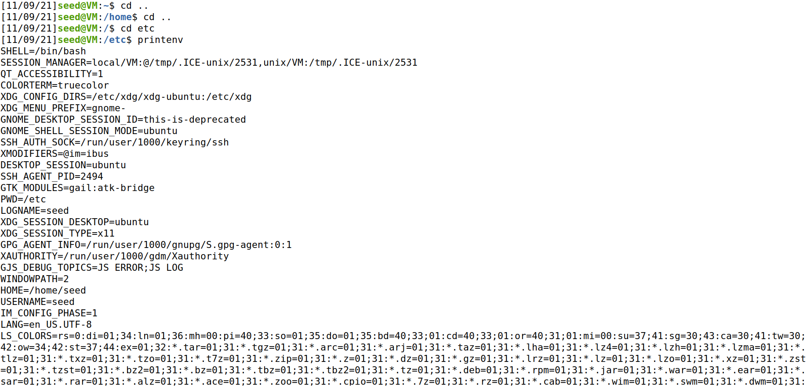

*Figure 1: Demonstrating printenv/env command* 

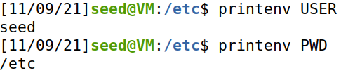

*Figure 2: Demonstrating printenv with an Environment Variable name to be found*

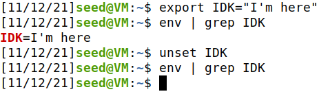

*Figure 3: Demonstrating export and unset commands*

## Task #2: Passing Environment Variables from Parent Process to Child Process

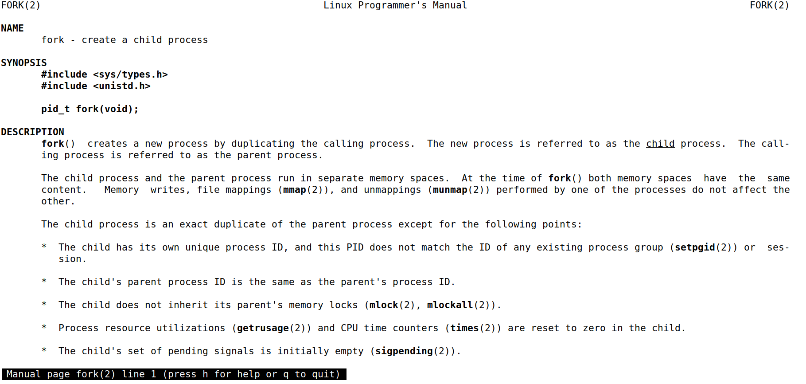

*Figure 4: Demonstrating "man fork"*

**Step 1**

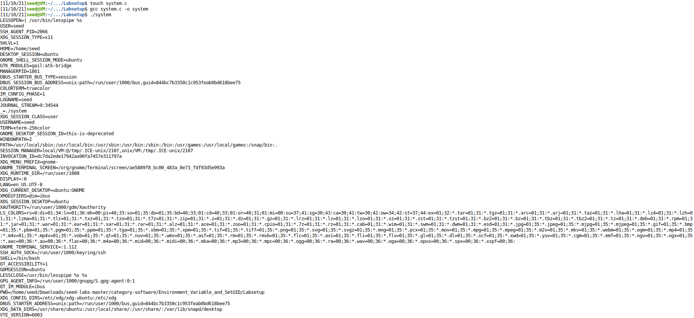

*Figure 5: Running the program provided by the Lab guide*

The variable environment contains the environmental variables and when printed it prints to the console the same as the console command printenv.

**Step 2**


*Figure 6: Child environment variables*

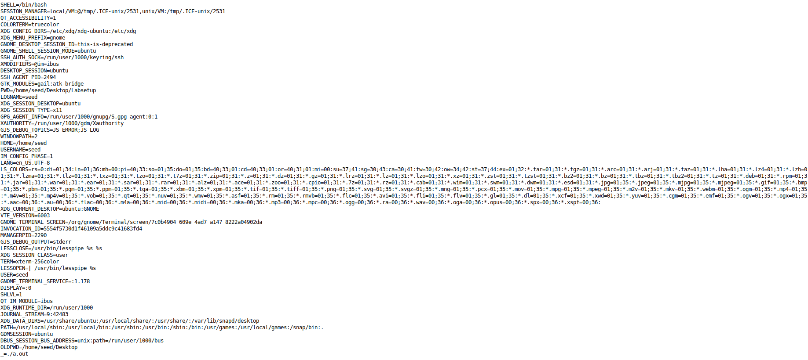

*Figure 7: Parent environment variables*

After printing the parent process environment variables and using the diff, we can observe that the parent process and the child process print the same environment variables. We can then conclude that the parent and child processes share their environment variables.

## Task #3: Environment Variables and execve()

The function *execve()* causes the program that is currently being run by the calling process to be replaced with a new program, with newly initialized stack, heap, and (initialized and uninitialized) data segments.

```
int execve(const char *pathname, char *const argv[], char *const envp[]);
```

Out of the presented arguments in this exercise we test what happens when we use two different pointers as the `char *const envp[]` which is an array of pointers to strings, conventionally of the form key=value, which are passed as the environment of the new program.

When *execve()* runs the “/usr/bin/env” with the envp variable as NULL it does not print anything by which we can assume that using NULL as our envp pointer does not transfer the environmental variables to the new program being run. In contrast when we run it with envp as “environ” we get the environmental variables printed exactly like they would if we used the command *printenv* on the console with the exception of the program path.

With these observations we can conclude that the environment variables of a process can be changed with the command *execve()* and that each process has its own set of environmental variables independent of other processes.

## Task #4: Environment Variables and system()

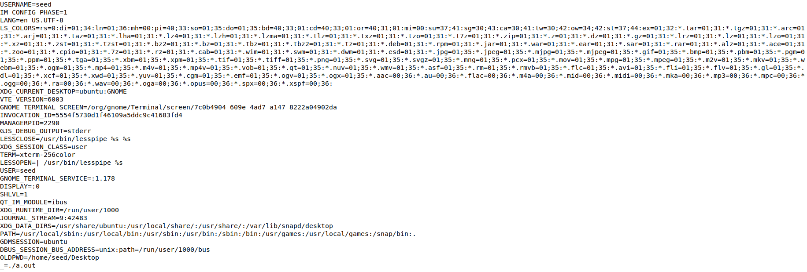

*Figure 8: Environmental variables when running execve() with enp set as environ*

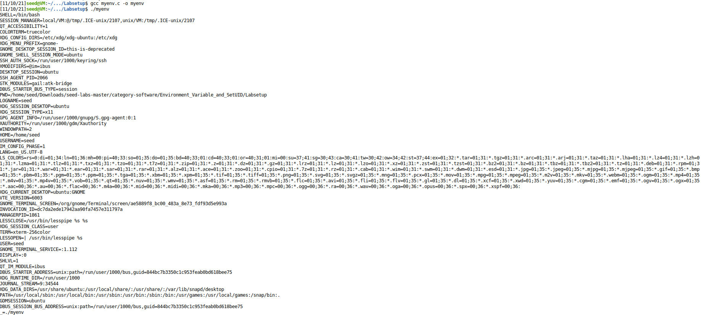

*Figure 9: Environmental variables when running system()*

## Task #5: Environment Variable Set-UID Programs

**Step 1**

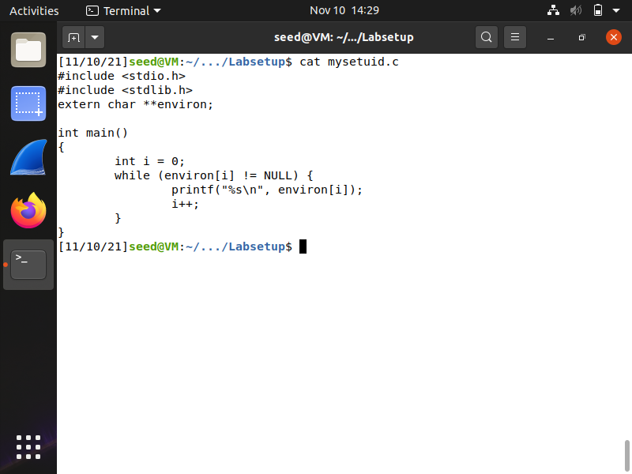

*Figure 10: Demonstrating mysetuid.c file*

**Step 2**

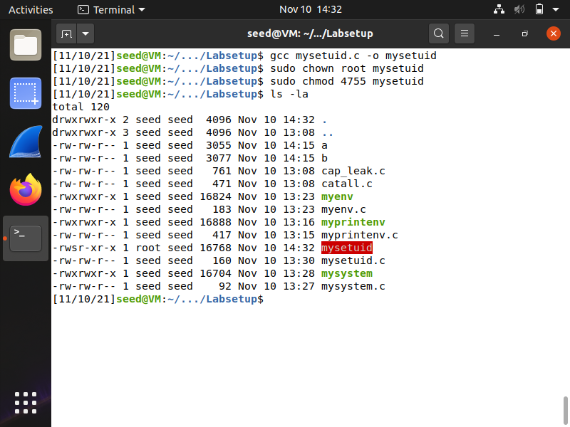

*Figure 11: Compiling mysetuid.c, changing its ownership to root and making it a Set-UID program*

**Step 3**

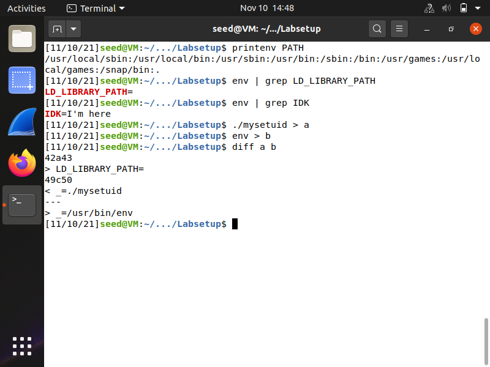

*Figure 12: Setting PATH, LD_LIBRARY_PATH and IDK environment variables using export command and comparing environmental variables from Set-UID program and env command in current shell*

As we can see, all but the LD_LIBRARY_PATH environmental variables have been inherited by the Set-UID program process. For context, LD_LIBRARY_PATH is used by the dynamic linker/loader from Linux, attackers can modify this variable and force the library loader to search for libraries in the attacker's directory. Therefore, to make sure these types of programs are safe from the manipulation of said variable, they ignore this environment variable.

> Sources: https://web.ecs.syr.edu/~wedu/Teaching/cis643/LectureNotes_New/Set_UID.pdf

## Task #6: The PATH Environment Variable and Set-UID Programs

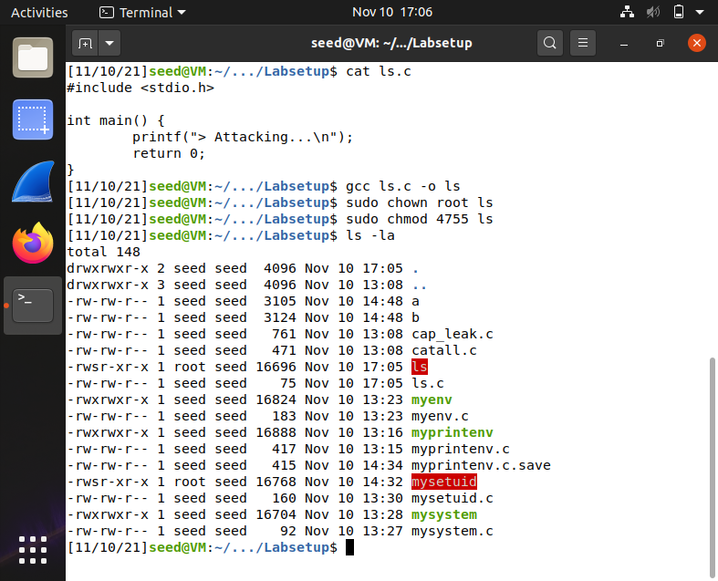

*Figure 12: Demonstrating ls.c file, compiling it, changing its ownership to root and making it a Set-UID program*

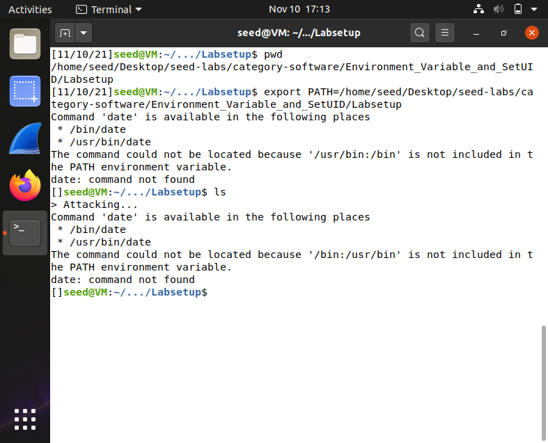

*Figure 13: Changing PATH to current directory with our ls program and running it as the original ls program*

As we can see, when the PATH environment variable is altered to our desired directory with the malicious code/program properly named with a common program name, such as "ls", the attacker's code is executed with root privileges owed to the fact that it's a Set-UID program.