# Week #5: Buffer Overflow Attack Lab (Set-UID Version)

## Task #1: Getting Familiar with Shellcode


|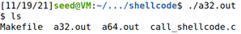| 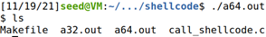|
|---|---|
|*Figure 1: Running the 32 bit shellcode*|*Figure 2: Running the 64 bit shellcode*|

We can observe and conclude that each binary runs the "sh" program with root privileges, since they are Set-UID programs and the "/bin/sh" drop of privilege countermeasure is disabled (this is done by redirecting it to a modified version of the "dash" program provided by the seed-lab authors).
## Task #2: Understanding the Vulnerable Program

```c
int main(int argc, char **argv)
{
    char str[517];
    FILE *badfile;

    badfile = fopen("badfile", "r"); 
    if (!badfile) {
       perror("Opening badfile"); exit(1);
    }

    int length = fread(str, sizeof(char), 517, badfile);
    printf("Input size: %d\n", length);
    dummy_function(str);
    fprintf(stdout, "==== Returned Properly ====\n");
    return 1;
}
```

In the "main" function we initialize a char array "str" that can store up to 517 elements. It'll try to open a file named "badfile" and read 517 bytes from it to the "str" array. Then it'll call the "dummy_function":

```c
void dummy_function(char *str)
{
    char dummy_buffer[1000];
    memset(dummy_buffer, 0, 1000);
    bof(str);
}
```

The "dummy_function" will allow us to not accidentally overwrite the main function block on the stack by initializing a "dummy_buffer" with 1000 bytes, essentially creating a blank canvas/space between the function that'll call afterwards and the main function. Then we'll call the "bof" function:

```c
#define BUF_SIZE 100

int bof(char *str)
{
    char buffer[BUF_SIZE];
    // The following statement has a buffer overflow problem 
    strcpy(buffer, str);       
    return 1;
}
```

The "bof" function will copy the 517 bytes read from the "badfile" in the "str" array to a smaller char array "buffer", that can only store up to 100 bytes. Since the "strcpy" does not check boundaries, buffer overflow will occur, and we'll exploit that in the next task.

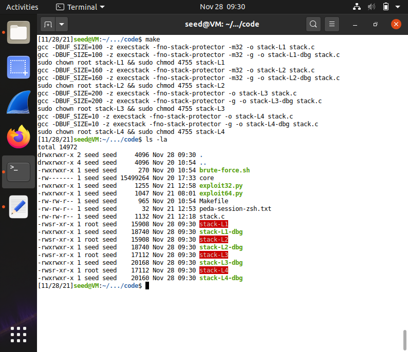

*Figure 3: Compiling stack.c using the Makefile provided.*

## Task #3: Launching Attack on 32-bit Program (Level 1)

### **Part 1: Investigation**

To exploit the buffer overflow vulnerability we have to first find out the distance between the buffer’s starting position and the place where the return-address is stored.

|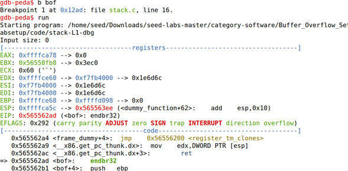| 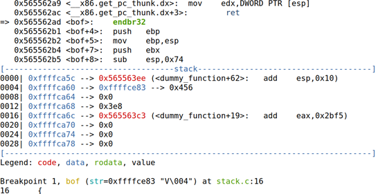|
|---|---|

*Figure 4 and 5: Debugging the program and stopping execution at the bof() function.*

|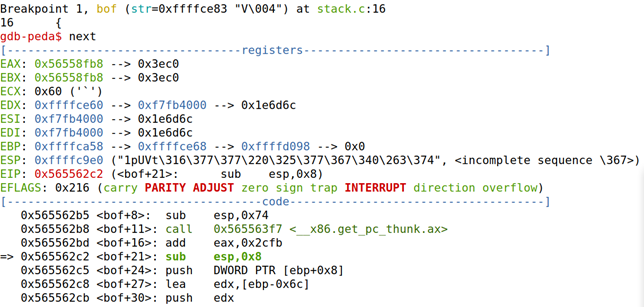| 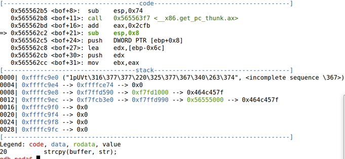|
|---|---|

*Figure 6 and 7: Advancing one step so that the ebp register is not the one from the caller but the one that is set by the bof() function.*

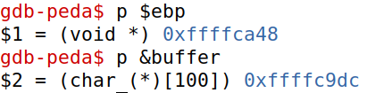

*Figure 8: Getting the ebp register’s value as well as the address of the buffer we want to overflow.*

With these two values we can obtain the return address location: it's the difference between the ebp and the buffer address plus 4 bytes, since the return address is directly after the ebp's address (32 bits / 8 bits [Char size] = 4).

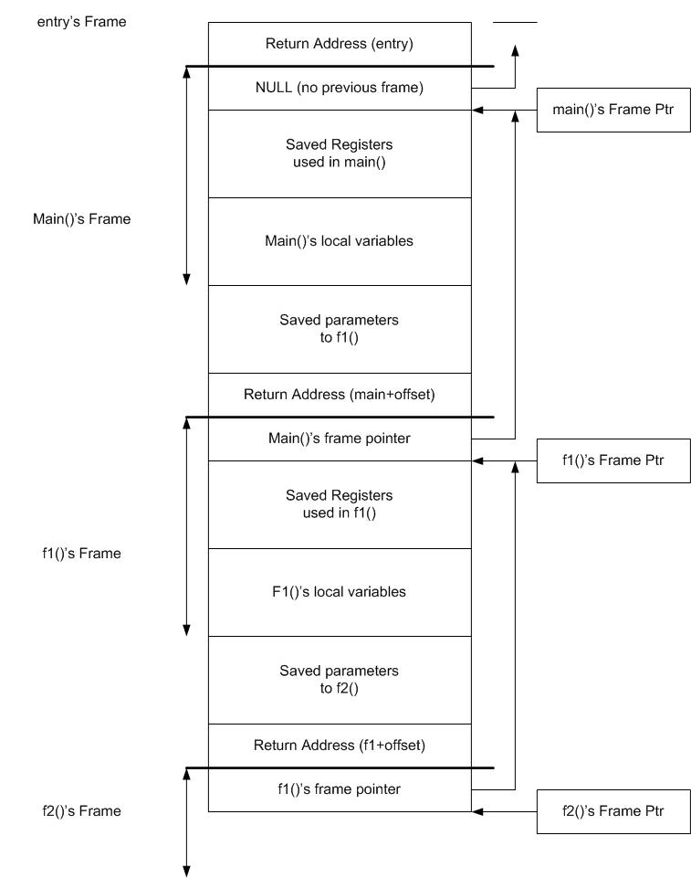

*Figure 9: Organization of a typical stack (https://www.backerstreet.com/red/stack_frames.htm)*

```
offset = ebp - buffer + 4
```

### **Part 2: Launching Attacks**

Firstly, we replace the Shellcode in the "exploit_example.py" file. Since we don’t want to run random code that might already be on the stack we have to fill it out with NOPs (no operation).

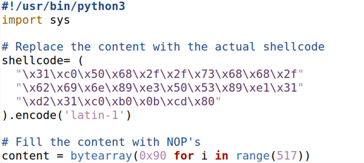

*Figure 10: Shellcode replaced and content filled with NOPs.*

The start value of the shell code is more or less arbitrary (it needs to be bigger than the offset so it’s not written in the return address and smaller than the difference between the badfile’s size and the shellcode size so that it fits) since we only have to make sure that the return address either lands on the shell code or a NOP which will eventually lead to the execution of the shell code. Therefore we decided to place it at the end of the buffer.

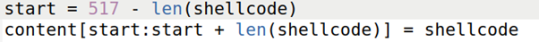

*Figure 11: start replaced.*

The return address is the buffer address plus a little bit more to compensate for the info added by gdb. Meanwhile the offset is the value calculated earlier in the part 2 of the same task.

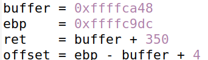

*Figure 12: ret and offset replaced.*

After running the python script, creating the "badfile" with the payload that we meticulously edited, and executing the "stack-L1" executable created by the Makefile provided the following will happen:

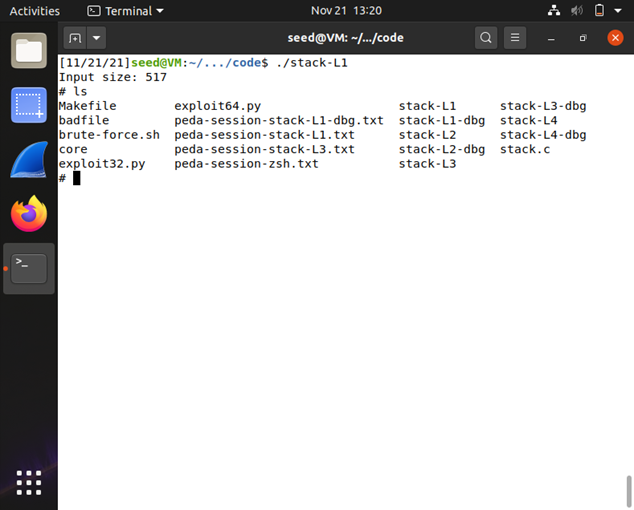

*Figure 13: successful attack.*

Since "stack-L1" is a Set-UID program and  "/bin/sh" drop of privilege countermeasure is disabled, we managed to obtain a "bash" program with root privileges.