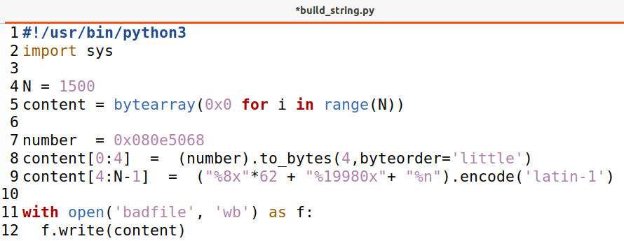

# Week #6: Format String Attack Lab

## TASK #1

To crash the program with the string format vulnerability we simply need to make printf read or write to an invalid address. We decided to try to read from one.

To achieve that we made use of the format string “%s”, when the a vulnerable printf function finds this string, instead of printing it out i’ll interpret it as a command and print out content from addresses in the stack, therefore if we send the program enough “%s” commands it will eventually attempt to read from an invalid address sending a SIGSEGV signal and crashing the program.

||
|---|
|*Figure 1: badfile filled with a big number of “%s” commands.*|

||
|---|
|*Figure 2: Sending the input to the server.*|

||
|---|
|*Figure 3: Crashed program after receiving the input.*|

## TASK #2

### **2.A**

||
|---|
|*Figure 4: badfile employed to know how many %p we will need to use to print out the first 4 bytes of our input string.*|

||
|---|
|*Figure 5: Output of “cat bafile | nc 10.9.0.5 9090” command.*|

||
|---|
|*Figure 6: After some tries we concluded that we need 64 %p’s to reach the first four bytes of the input string.*|

### **2.B**

||
|---|
|*Figure 7: build_string.py employed to print out the secret message in the address 0x080b4008.*|

||
|---|
|*Figure 8: As expected, the secret message “A secret message” is printed at the end of the output of the server docker container without a system crash.*|

## TASK #3

### **3.A**

||
|---|
|*Figure 9: build_string.py employed to change the value of the target variable.*|

||
|---|
|*Figure 10: target variable’s value changes from 0x11223344 to 0x000001ac.*|

### **3.B**

||
|---|
|*Figure 11: build_string.py employed to change the value of the target variable to 5000.*|

In order to overwrite the value of the target variable we need to:
1. Push the variable’s address to the stack (0x080e5068)
2. Move to the variable’s address using 62 “%8x”;
3. Place 19980 characters before “%n” so that it writes the correct value to the variable’s address. The 4 bytes occupied by the address plus the command “%19980x”, which writes 19980 characters, plus the 62 times we write the “%8x”, which writes 8 bytes each time, give us the 20480 characters that we needed to place before the %n (4 + 62*8 + 19980 = 20480).

||
|---|
|*Figure 12: target variable’s value changes from 0x11223344 to 0x5000.*|