# Week #8: Web SQL Injection

## Task #1

|    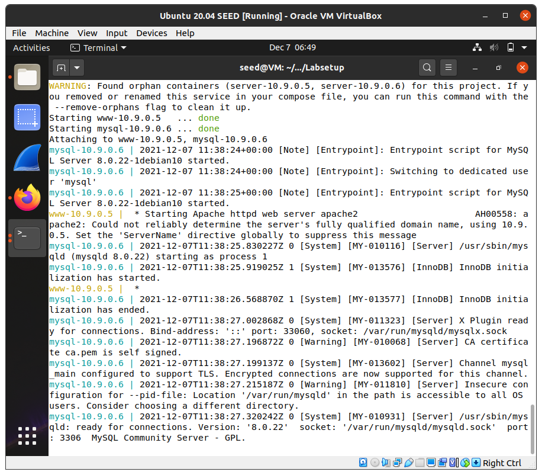     |
| :----------------------------------------: |
| *Figure 1: Starting the docker container.* |

|       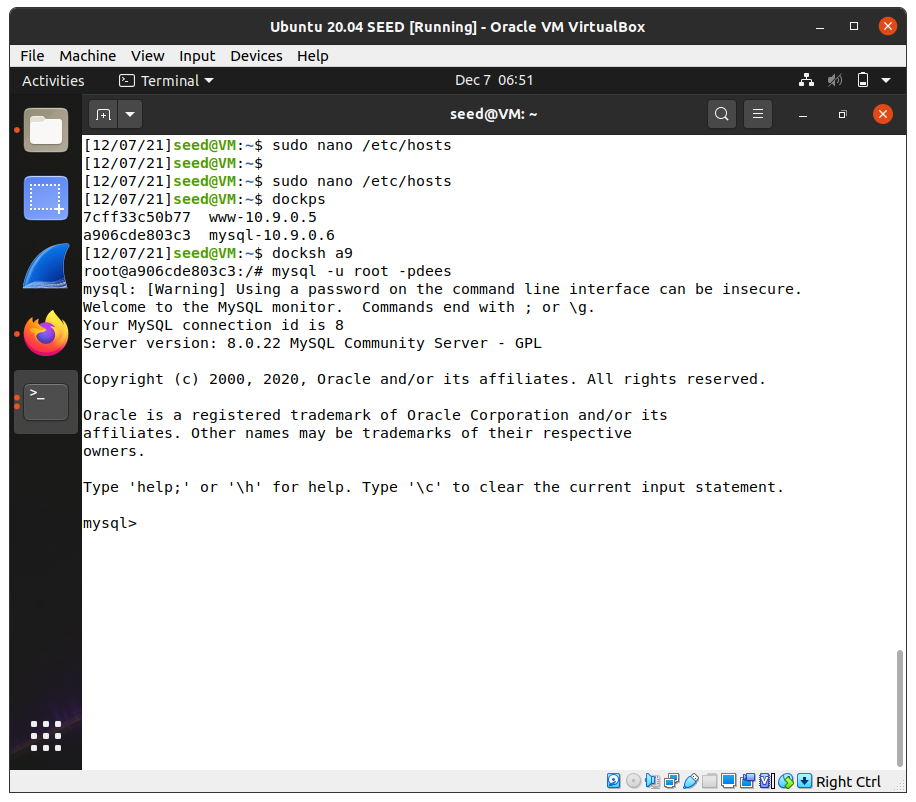       |
| :---------------------------------------------: |
| *Figure 2: Running a shell on MySQL container.* |

|             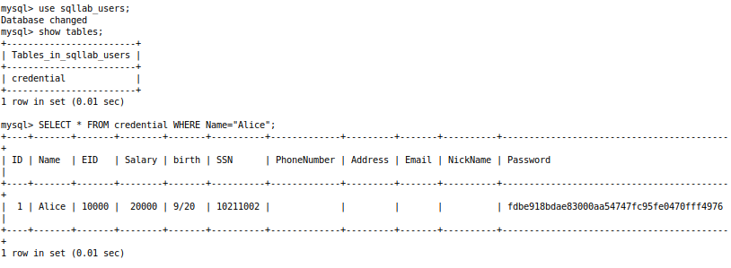              |
| :----------------------------------------------------------: |
| *Figure 3: Using a query to print all the information of the employee Alice.* |

## Task #2

### Task #2.1

|    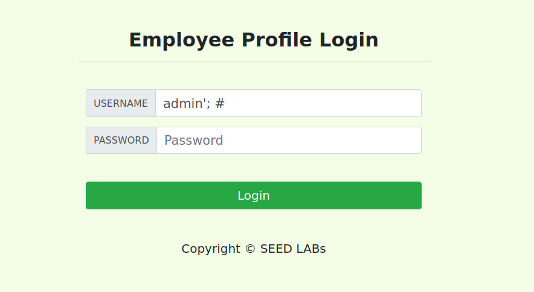    |
| :---------------------------------------: |
| *Figure 4: Username used for the attack.* |

| 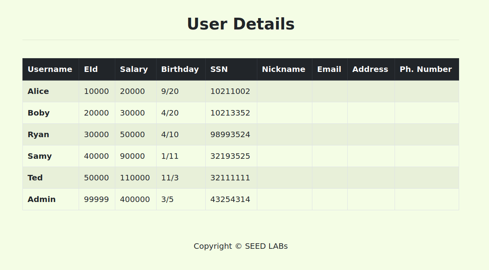 |
| :---------------------------------: |
| *Figure 5: Employee's information.* |

### Task #2.2

|     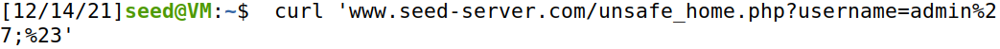      |
| :------------------------------------------: |
| *Figure 6: Login attempt with curl command.* |

|       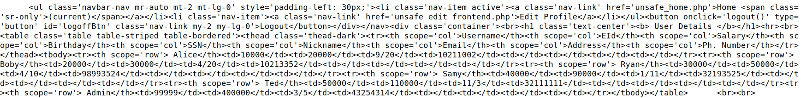        |
| :----------------------------------------------: |
| *Figure 7: Curl result (table from query only).* |

### Task #2.3

It is impossible to run two SQL statements against MySQL because of the PHP's extension mysqli. This extension's method query()'s API does not allow multiple queries to run in the database server.

## Task #3

### Task #3.1

| 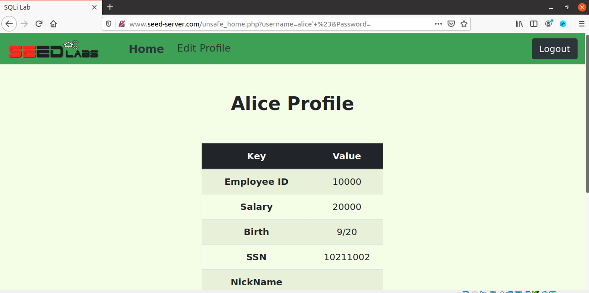 |
| :---------------------------------: |
|  *Figure 8: Alice's initial data.*  |

The php executes the following SQL query when editing someone's profile data:

```php
$hashed_pwd = sha1($input_pwd);
$sql = "UPDATE credential
SET nickname='$input_nickname',
email='$input_email',
address='$input_address',
password='$hashed_pwd',
PhoneNumber='$input_phonenumber'
WHERE ID=$id;";
$conn->query($sql);
```

To update our salary which is not part of the initial query we need to use `,` and ` ' ` to put the salary update into the query so that it results in the following:

```php
$hashed_pwd = sha1($input_pwd);
$sql = "UPDATE credential
SET nickname='', salary='30000',
email='$input_email',
address='$input_address',
Password='$hashed_pwd',
PhoneNumber='$input_phonenumber'
WHERE ID=$id;";
$conn->query($sql);
```

The initial quotes are going to leave the nickname space blank and allow us to inserts another column to update. Therefore if we insert `, salary='30000` into the nickname field we are able to change Alice's salary to 3000.

|             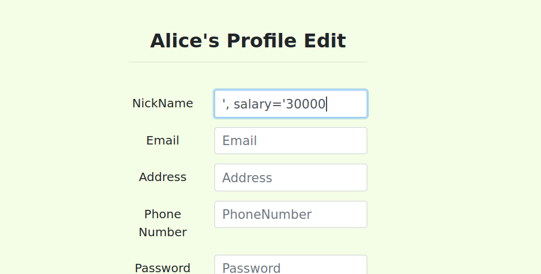              |
| :----------------------------------------------------------: |
| *Figure 9: Introducing `, salary='30000` into the profile edition page.* |

|             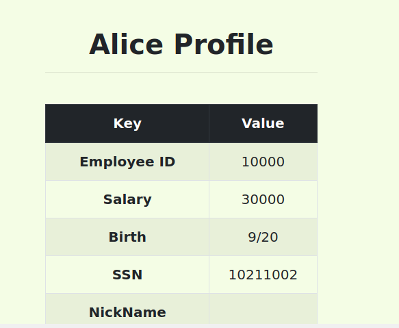              |
| :----------------------------------------------------------: |
| *Figure 10: Salary altered to 30000 due to the SQL injection.* |

### Task #3.2

In the admin's profile we can see that Boby's salary is 3000.

| 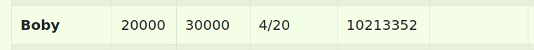 |
| :---------------------------------: |
|  *Figure 11: Boby's profile data.*  |

From Alice's editing page, if we consider the update query like above we can make the following changes to change Boby's salary to 1:

```php
$hashed_pwd = sha1($input_pwd);
$sql = "UPDATE credential SET
nickname='', salary=1 WHERE name='Boby'--',
email='$input_email',
address='$input_address',
Password='$hashed_pwd',
PhoneNumber='$input_phonenumber'
WHERE ID=$id;";
$conn->query($sql);
```

The name of the column name was taken from task 2 but could just as easily have been guessed until one worked. The “--” at the end is meant to comment all the statements that come after, making the query end in the WHERE statement created by us that selects Boby's profile.

|             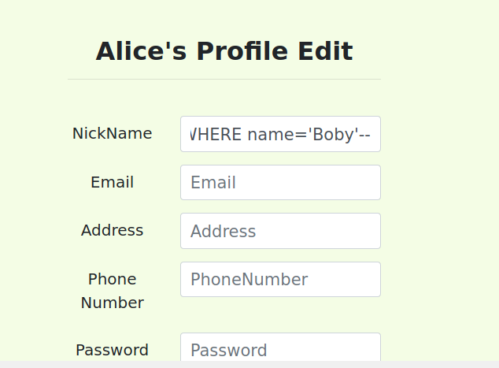              |
| :----------------------------------------------------------: |
| *Figure 12: Editing Boby's salary from Alice's profile editing page.* |

|             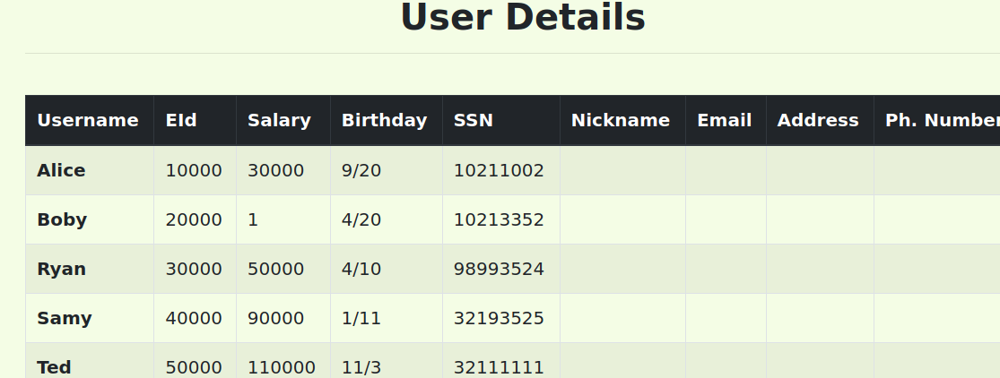              |
| :----------------------------------------------------------: |
| *Figure 13: Logging into the administrator's page so that we can observe that the changes were successful.* |